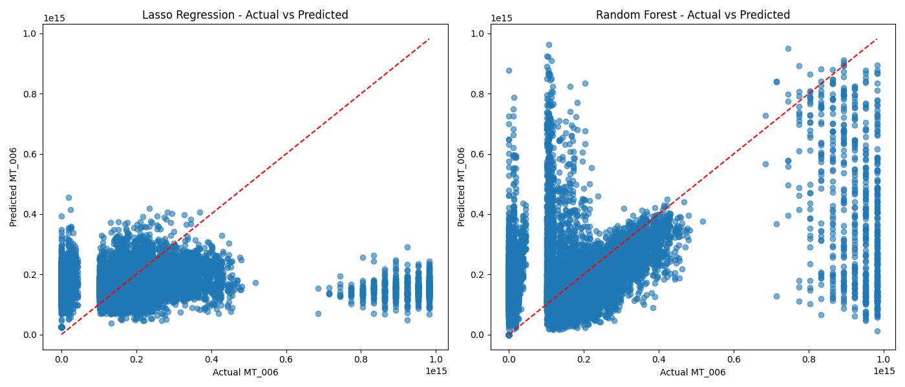
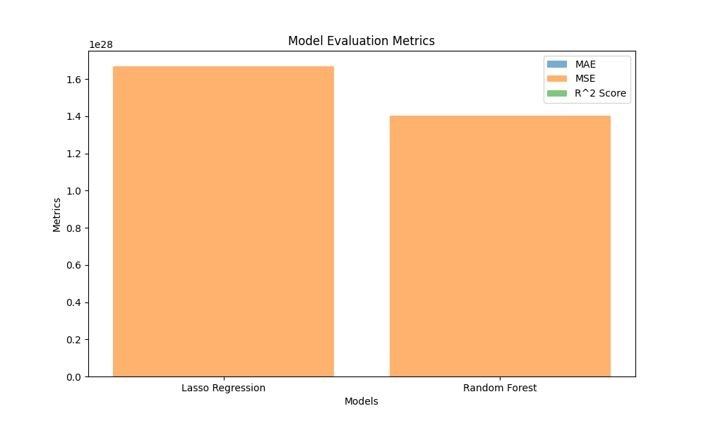

# پیش‌بینی متغیر MT_006 با Lasso و Random Forest

این پروژه پیش‌بینی متغیر **MT_006** را با استفاده از مدل‌های **Lasso Regression** و **Random Forest** انجام می‌دهد. داده‌ها شامل ویژگی‌های MT_001 تا MT_005 هستند.

## نتایج مدل‌ها

| مدل               | MAE              | MSE               | R² Score |
|-------------------|------------------|-------------------|----------|
| Lasso Regression  | 5.28 × 10¹²      | 4.90 × 10²⁶      | 0.83     |
| Random Forest     | 4.91 × 10¹²      | 3.95 × 10²⁶      | 0.86     |

مدل **Random Forest** نسبت به **Lasso Regression** عملکرد بهتری در پیش‌بینی نشان داده است.

## نمودارها
<!-- [MB] -->
